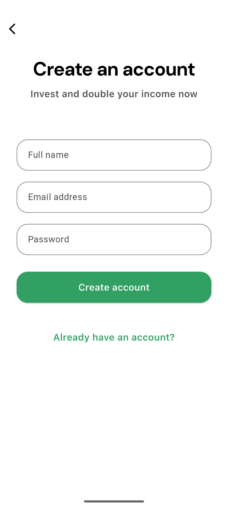
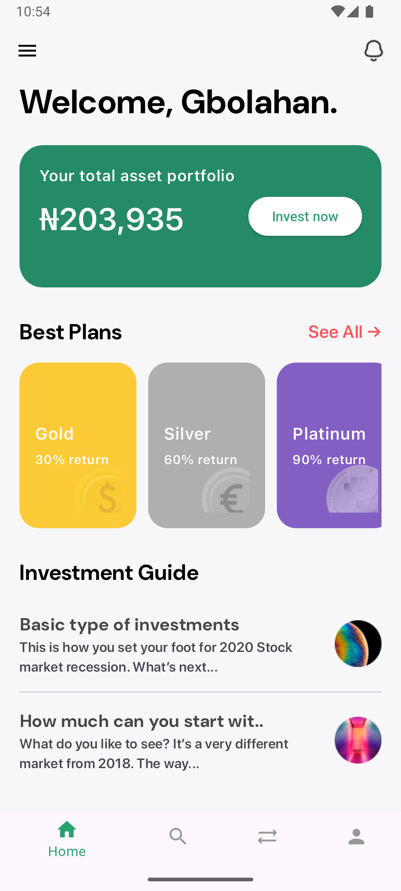
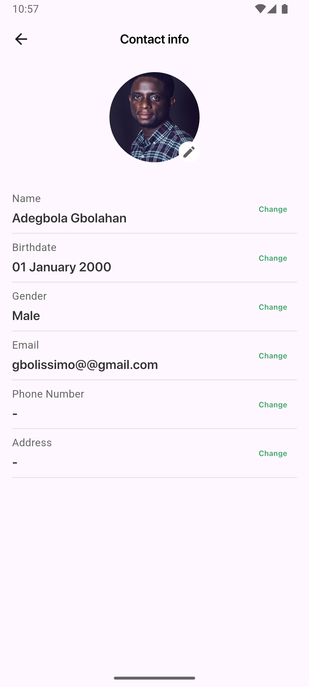

# investify

An investment platform project. (Coding Assessment)

## Getting Started

# For sandbox flavor
flutter run -t lib/main_sandbox.dart --flavor sandbox

# For live flavor
flutter run -t lib/main_live.dart --flavor live

# Screenshots

  
  
  

  
  
  

